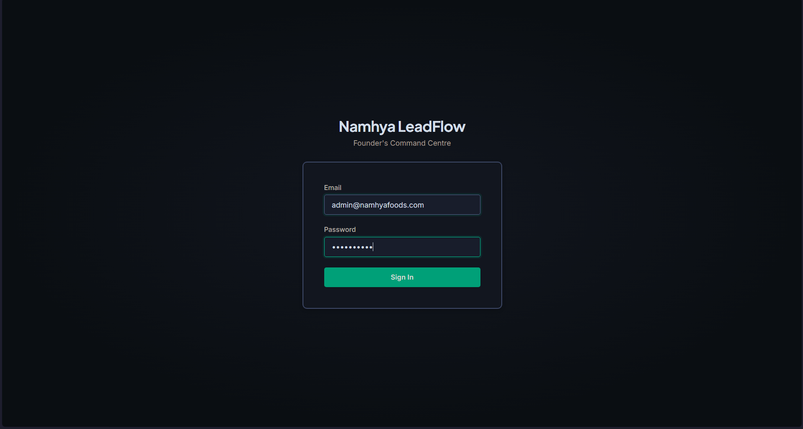
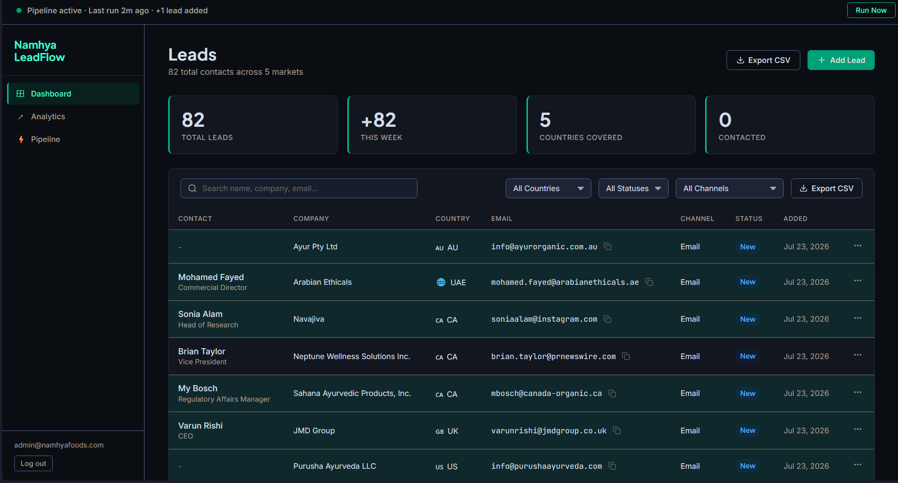
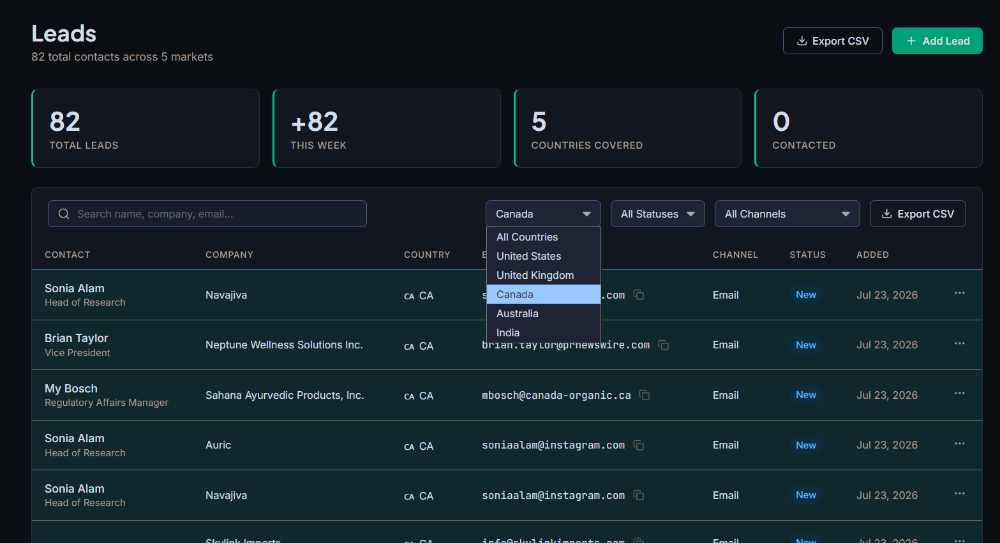
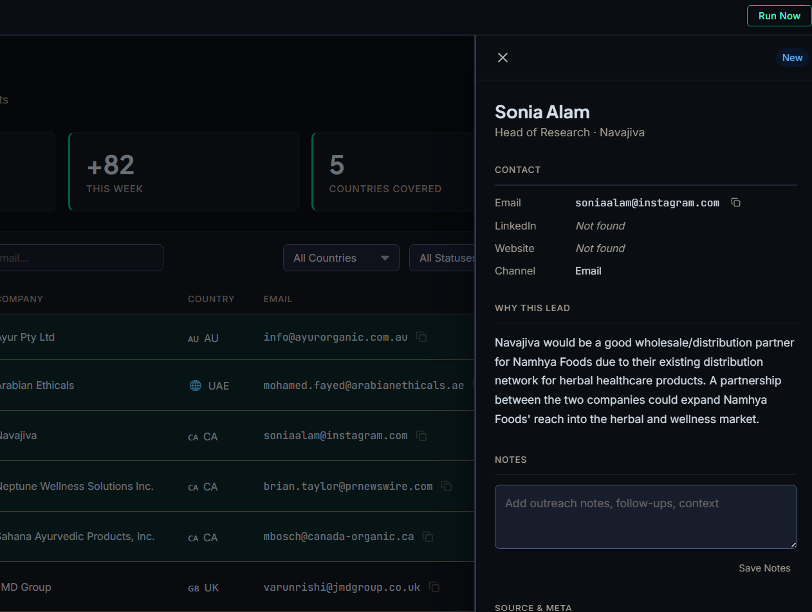
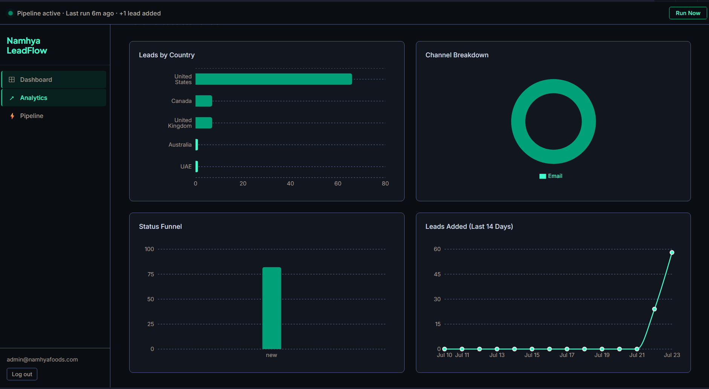
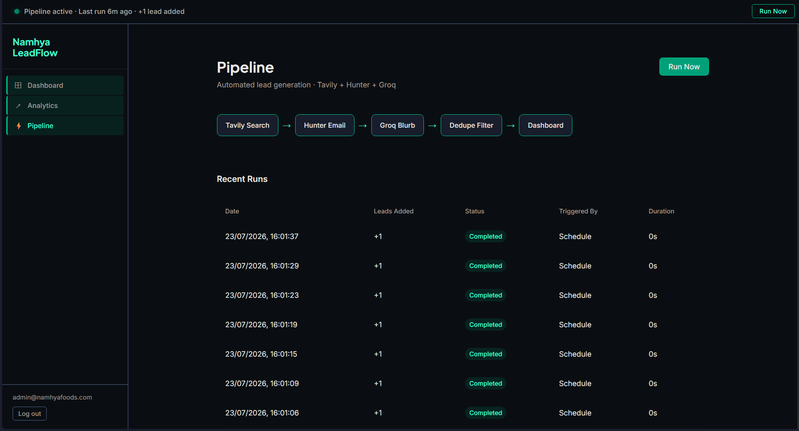
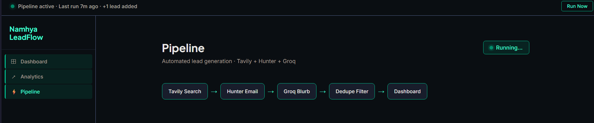
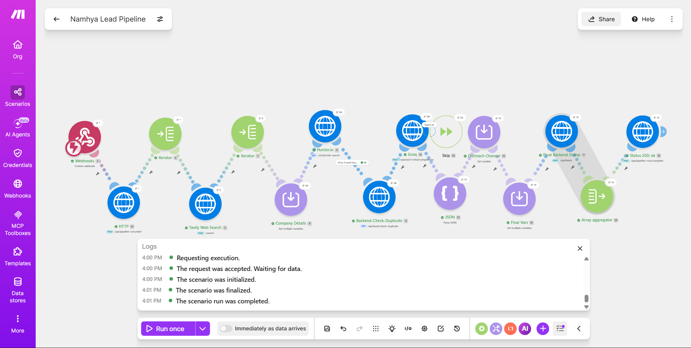

# Connexa — Where Namhya's Ayurvedic Wisdom Finds Its Next Home

> **Automated B2B lead generation + outreach management dashboard for Namhya Foods' global expansion.**

Namhya LeadFlow is an end-to-end system that automatically discovers potential distribution and partnership leads across 5 international markets every morning, enriches them with contact details and AI-written relevance notes, deduplicates them, and saves them into a clean dashboard, so the founder can start outreach with one click, not 3 hours of research.

---

## Screenshots

> 📂 [View full screenshot gallery →](./docs/screenshots.md)

| | |
|---|---|
|  |  |
| *Login page* | *Leads dashboard* |
|  |  |
| *Filter bar open* | *Lead detail drawer* |
|  |  |
| *Analytics charts* | *Pipeline page* |
|  |  |
| *Pipeline Pulse bar - running state* | *Make.com scenario canvas* |

---

## Table of Contents

1. [What It Does](#1-what-it-does)
2. [How Everything Connects](#2-how-everything-connects)
3. [The Make.com Automation Workflow](#3-the-makecom-automation-workflow)
4. [The Dashboard - Feature by Feature](#4-the-dashboard--feature-by-feature)
5. [Tech Stack](#5-tech-stack)
6. [Environment Variables](#6-environment-variables)
7. [Deploying the App](#7-deploying-the-app)
8. [Scaling & Future Additions](#8-scaling--future-additions)

---

## 1. What It Does

Every morning at 9:00 AM IST (3:30 UTC), an automated pipeline runs entirely in the cloud - no laptop needed, no manual work:

1. **Searches the web** for ayurveda/wellness importers and distributors in the US, UK, Canada, UAE, and Australia using **Tavily** (an AI-optimised search API)
2. **Finds contact emails** for each company using **Hunter.io**'s domain search
3. **Writes a personalised relevance note** for each lead using **Groq AI** (Mixtral 8x7B), explaining specifically why that company is a fit for Namhya Foods
4. **Deduplicates** - checks if the lead already exists in the database before saving
5. **Saves** each new lead to the database with a full profile

The founder wakes up, opens the dashboard, and sees new qualified leads with emails and AI notes already written - ready to copy the email and reach out.

---

## 2. How Everything Connects

```
                        ┌─────────────────────────┐
                        │     Make.com (Cloud)     │
                        │                          │
  ┌──────────┐  POST    │  Tavily → Hunter → Groq  │
  │ Dashboard│─────────▶│  (runs automatically or  │
  │ Run Now  │  webhook │  on manual trigger)      │
  └──────────┘          │          │               │
                        │          │ POST leads    │
                        └──────────┼───────────────┘
                                   │
                                   ▼
                        ┌─────────────────────────┐
                        │   Node.js Backend        │
                        │   (Render.com)           │
                        │   /api/leads             │
                        │   /api/pipeline-runs     │
                        │   /api/analytics         │
                        └──────────┬──────────────┘
                                   │
                          MongoDB Atlas
                          (cloud database)
                                   │
                        ┌──────────▼──────────────┐
                        │   React Dashboard        │
                        │   (Vercel)               │
                        │   Login, Leads Table,    │
                        │   Analytics, Pipeline    │
                        └─────────────────────────┘
```

**Key security detail:** Make.com sends a secret header (`x-pipeline-secret`) with every request to the backend. The backend checks this header before accepting any data - so no one else can inject fake leads.

---

## 3. The Make.com Automation Workflow

The entire pipeline runs inside **Make.com** - a no-code automation tool. Think of it as a visual flowchart where each box is a step, and data flows left to right.


### Triggers (how the pipeline starts)

There are two ways the pipeline can start:

**A - Automatic (every morning):**
A `Schedule` module runs at 3:30 UTC (9:00 AM IST), every day, automatically.

**B - Manual (from the dashboard):**
When you click the **"Run Now"** button on the Pipeline page or the top bar, the frontend sends a POST request to a Make.com **webhook URL**. Make.com receives it and immediately starts the pipeline. Both paths merge into a single `Router` module, so the rest of the pipeline is identical either way.

---

### Step-by-Step Pipeline Walkthrough

**Step 1 - Set search queries**
The pipeline hardcodes 5 search strings, one per target market:
- `"ayurveda wellness tea distributor importer United States contact email"`
- `"herbal health food broker importing agency United Kingdom wellness contact"`
- `"organic wellness CPG distribution partner Canada ayurveda contact"`
- `"health food importing agency Dubai UAE wellness herbal contact"`
- `"ayurveda supplement natural food distributor Australia contact email"`

These are carefully written to find B2B distribution companies - not end consumers or retailers.

---

**Step 2 - Loop through each query (Iterator)**
Make.com's `Iterator` module runs Steps 3–11 five times - once per search query. Each iteration processes one market.

---

**Step 3 - Tavily Search**
Each query is sent to the **Tavily API**, which performs an advanced web search and returns up to 10 company results. Each result has:
- Company name
- Website URL
- A content snippet describing the company

Tavily is used instead of Google because it returns clean, structured, AI-optimised results - ideal for this kind of business discovery.

---

**Step 4 - Extract company details**
For each of the 10 results, Make.com extracts:
- `companyName` - from the search result title
- `companyWebsite` - the website URL
- `companyDescription` - the content snippet

Another `Iterator` loops through all 10 results, processing each one individually.

---

**Step 5 - Hunter.io Domain Search**
The company's domain is extracted from the website URL and sent to **Hunter.io**. Hunter searches for all known email addresses at that domain and returns:
- Email address
- First name, last name, job title
- Confidence score (0–100)

Only emails with a confidence score above 70 are used. This filters out guessed emails and keeps only verified addresses.

---

**Step 6 - Duplicate Check**
Before doing any AI work, Make.com calls your backend:
```
GET /api/leads/check-duplicate?email=someone@company.com
```
The backend checks if that email already exists in the database and responds with `{ "exists": true }` or `{ "exists": false }`.

A **Filter** module then stops processing if the lead already exists - no duplicates are ever saved.

---

**Step 7 - Groq AI writes the relevance note**
For every new lead that passes the duplicate filter, the company's name and description are sent to **Groq** (running Mixtral 8x7B). The AI is given this prompt:

> *"Namhya Foods is an Ayurveda-led D2C wellness tea brand from India, featured on Shark Tank India, now expanding to US, UK, Canada, UAE, and Australia. In exactly 1-2 sentences, explain why [company name] could be a strong distribution or partnership candidate..."*

The result is a specific, non-generic 1–2 sentence note explaining exactly why that company is a fit. This is what appears in the lead drawer as "Why This Lead."

---

**Step 8 - Determine outreach channel**
A simple logic rule decides how to reach out:
- If Hunter found an email → **Email**
- If no email but LinkedIn URL detected → **LinkedIn DM**
- Otherwise → **Website Contact Form**

---

**Step 9 - Save the lead**
The complete lead object is POSTed to your backend:
```
POST /api/leads
x-pipeline-secret: [your secret]
```
The backend validates and saves it to MongoDB.

---

**Step 10 - Mark the run as complete**
After all leads from all 5 markets are processed, one final call is made:
```
POST /api/pipeline-runs/complete
{ "status": "completed", "leadsAdded": N }
```
This is what triggers the dashboard's polling to stop and shows the "Pipeline complete · +N leads added" toast notification.

---

### Free Tier Math

| Service | Free Allowance | Used Per Run |
|---|---|---|
| Make.com | 1,000 ops/month | ~205 ops per full run |
| Tavily | 1,000 searches/month | 5 per run |
| Hunter.io | 50 credits/month | Up to 50 per run |
| Groq | 14,400 requests/day | Up to 50 per run |
| MongoDB Atlas | 512 MB forever | ~1 MB per run |

**Result:** ~4 full pipeline runs per month on free tiers. More than enough for this use case.

---

### Warmup Ping (Optional but Recommended)

Render's free backend goes to sleep after 15 minutes of inactivity. A second Make.com scenario runs every 10 minutes, sending a `GET` request to `/api/health` to keep the backend awake. This prevents a 30-second cold start delay when the pipeline fires.

---

## 4. The Dashboard - Feature by Feature


### Login Page

A clean, centred login form. One admin account - protected by JWT (JSON Web Token) with a 7-day expiry. After login, the token is stored in the browser and sent automatically with every request to the backend.

---

### Pipeline Pulse Bar


The thin bar fixed at the very top of every page. One glance tells you everything about the pipeline:

- **Jade pulsing dot** → pipeline ran within the last 24 hours, all good
- **Saffron static dot** → pipeline had a failure
- **Grey dot** → no recent run

It also shows when the last run was and how many leads were added. The **Run Now** button on the right triggers the pipeline manually from anywhere in the app.

---

### Dashboard - Leads Table


**Stats bar** - 4 cards at the top showing:
- Total leads in the database
- Leads added this week
- Number of markets covered (out of 5)
- Leads that have been contacted (status is not "New")

**Filter bar** - Search by name, company, or email. Filter by Country, Status, or Outreach Channel. All filters work together and update the table instantly.

**Leads table** - Each row shows:
- Contact name + job title
- Company
- Country with flag emoji
- Email address (click the copy icon to copy to clipboard)
- Outreach channel
- Status badge (colour-coded)
- Date added

**Row actions (···)** - Click the three dots on any row to quickly change the lead's status without opening the full modal. Great for quickly marking leads as "Contacted" after sending an email.

**Export CSV** - Downloads the current filtered view as a CSV file, compatible with Excel and Google Sheets. Includes all columns: name, company, email, country, channel, status, notes, and date added.

---

### Lead Detail Drawer


Click any row to open the lead's full profile in a drawer that slides in from the right:

- Full contact information (email, LinkedIn, website)
- **"Why This Lead"** - the Groq-generated relevance note explaining why this company is a fit for Namhya
- **Notes field** - type outreach notes, follow-up context, conversation history. Saves automatically on blur.
- **Status dropdown** - change the lead's status directly from the drawer. Auto-saves and shows a toast confirmation.
- Source and metadata (when added, which country, where the lead came from)

---

### Analytics Page


Four charts giving a market-wide view of the pipeline:

1. **Leads by Country** (horizontal bar chart) - see which markets have the most leads
2. **Outreach Channel Breakdown** (donut chart) - email vs LinkedIn vs website contact form
3. **Status Funnel** (bar chart) - how many leads are New, Contacted, Responded, Converted
4. **Leads Added Over Time** (line chart) - daily additions over the last 14 days

All data is live from the backend - refreshes on every page load.

---

### Pipeline Page


- Visual diagram showing the 5-step pipeline flow: Tavily → Hunter → Groq → Dedupe → Dashboard
- **Run Now** button - triggers the pipeline manually
- **Recent Runs** table - shows the last 20 pipeline runs with date, leads added, status, who triggered it, and duration

Status colours in the run table:
- 🟡 **Running** - saffron, pipeline currently in progress
- 🟢 **Completed** - jade, finished successfully
- 🔴 **Failed** - red, something went wrong

---

## 5. Tech Stack

| Layer | Tool | Where It Runs |
|---|---|---|
| Automation | Make.com | Cloud (Make servers) |
| Lead Discovery | Tavily API | Called by Make.com |
| Email Finding | Hunter.io API | Called by Make.com |
| AI Blurb | Groq (Mixtral 8x7B) | Called by Make.com |
| Database | MongoDB Atlas M0 | Cloud (MongoDB servers) |
| Backend | Node.js + Express | Render.com |
| Frontend | React + Vite | Vercel |
| Charts | Recharts | Bundled in frontend |
| Routing | React Router v7 | Bundled in frontend |

---

## 6. Environment Variables

### Frontend (set in Vercel dashboard)

| Variable | What it is |
|---|---|
| `VITE_API_URL` | Your Render backend URL, e.g. `https://connexa-backend.onrender.com` |
| `VITE_MAKE_WEBHOOK_URL` | The webhook URL from Make.com (from your custom webhook module) |

### Backend (set in Render dashboard)

| Variable | What it is |
|---|---|
| `MONGO_URI` | Your MongoDB Atlas connection string |
| `JWT_SECRET` | Any long random string - used to sign login tokens |
| `PIPELINE_SECRET` | Any long random string - Make.com sends this in every request header so your backend only accepts calls from Make |
| `FRONTEND_URL` | Your Vercel frontend URL - used for CORS |
| `PORT` | Set automatically by Render, no need to set manually |

---

## 7. Deploying the App

### Backend (Render)
1. Push the `Backend/` folder to GitHub
2. Create a new **Web Service** on [render.com](https://render.com)
3. Connect your GitHub repo, set Root Directory to `Backend`
4. Build command: `npm install`
5. Start command: `npm start`
6. Add all backend environment variables in the Render dashboard
7. Once deployed, seed the admin user once: run `node scripts/seed.js` locally pointing at your Atlas URI

### Frontend (Vercel)
1. Create a new project on [vercel.com](https://vercel.com)
2. Connect your GitHub repo, set Root Directory to `Frontend`
3. Framework Preset: **Vite** (Vercel detects this automatically)
4. Add `VITE_API_URL` and `VITE_MAKE_WEBHOOK_URL` in the Vercel environment variables section
5. Deploy - the `vercel.json` file in the Frontend folder ensures React Router works correctly on refresh

### Make.com
1. Create a new scenario: **"Namhya Lead Pipeline"**
2. Build the 14 modules as described in Section 3
3. Replace all placeholder values (`YOUR_TAVILY_KEY`, `YOUR_HUNTER_KEY`, `YOUR_GROQ_KEY`, `YOUR_SECRET`, `your-backend.onrender.com`) with real values
4. Turn on the scenario scheduler
5. Create a second scenario: **"Warmup Ping"** - schedule every 10 minutes, GET to `/api/health`

---

## 8. Scaling & Future Additions

The architecture is intentionally modular. Everything below is a clean addition that doesn't break what exists.

### Easy Wins (no backend changes needed)
- **Add more target countries** - Update the 5 search queries in Make.com Module 2. The `Lead.js` model's country enum just needs a new value added.
- **Change search queries** - Edit the query strings in Make.com Module 2 to target different industries or company types.
- **Adjust pipeline schedule** - Change the time in Make.com's Schedule module. No code changes.
- **Add more analytics charts** - The `/api/analytics/summary` endpoint already returns rich data. Just add more `<Recharts>` components to `AnalyticsPage.jsx`.

### Medium Additions (small backend + frontend work)
- **Email outreach tracker** - Add a `lastContactedAt` field to the Lead model. Build a simple "Mark as Contacted + log timestamp" flow in the modal.
- **LinkedIn URL discovery** - Add a LinkedIn search step in Make.com using the company name. Hunter.io sometimes returns LinkedIn URLs already.
- **Bulk status update** - The table already has checkboxes. Wire them up to a "Mark selected as Contacted" button using `PUT /api/leads/:id` in a loop.
- **Notes history / timeline** - Instead of overwriting the notes field, append entries with timestamps. Requires a `notes` array in the Lead schema.
- **More pipeline triggers** - Add a Make.com webhook for "Run for one specific country" - pass a country param in the body, filter the iterator to only run that query.

### Bigger Additions
- **Email sending** - Integrate SendGrid or Resend into the backend. Add a "Send Email" button in the drawer that uses the lead's email and a pre-written template.
- **User roles** - The `User` model already has a `role` field. Add an `intern` role with read-only access. The `requireAuth` middleware can check `req.user.role`.
- **Slack/WhatsApp notifications** - Add a Make.com module at the end of the pipeline that sends a Slack message: "Pipeline complete: +N leads added across US, UK, CA, UAE, AU."
- **Scoring system** - Add a `score` field to leads (0–100). Make.com can calculate a score based on email confidence, company description relevance, etc. Sort leads by score in the dashboard.
- **Multiple pipeline scenarios** - Create separate Make.com scenarios for different verticals: health food retailers, Ayurveda practitioners, e-commerce platforms. Each saves leads with a `source` tag so they're filterable.

### **This is a functional MVP, not the final form. With more time, Connexa's UI can be rebuilt into a polished, branded SaaS experience, and the pipeline itself can scale to pull 200+ leads a month across new markets as Namhya grows global.**

---

## Project Structure

```
Connexa/
├── Backend/
│   ├── models/
│   │   ├── Lead.js           - Lead data structure
│   │   ├── PipelineRun.js    - Pipeline run history
│   │   └── User.js           - Admin user
│   ├── routes/
│   │   ├── auth.js           - Login + /me
│   │   ├── leads.js          - CRUD + export + duplicate check
│   │   ├── analytics.js      - Summary stats for charts
│   │   └── pipeline.js       - Run history + start/complete
│   ├── middleware/
│   │   ├── requireAuth.js    - JWT validation for frontend calls
│   │   └── requirePipeline.js - Pipeline secret for Make.com calls
│   ├── scripts/
│   │   └── seed.js           - Creates the admin user in MongoDB
│   └── server.js             - Express app entry point
│
├── Frontend/
│   ├── src/
│   │   ├── api/axios.js          - Axios instance with auth interceptor
│   │   ├── context/
│   │   │   ├── AuthContext.jsx   - Login state + token management
│   │   │   └── ToastContext.jsx  - Global toast notifications
│   │   ├── components/
│   │   │   ├── common/           - StatusBadge, ToastContainer, Pagination
│   │   │   ├── dashboard/        - StatsBar, FilterBar, LeadsTable, LeadModal
│   │   │   └── layout/           - AppShell, Sidebar, PipelinePulse
│   │   └── pages/
│   │       ├── LoginPage.jsx
│   │       ├── DashboardPage.jsx
│   │       ├── AnalyticsPage.jsx
│   │       └── PipelinePage.jsx
│   └── vercel.json               - Rewrites for React Router on Vercel
│
└── vercel.json                   - Same, for repo-root Vercel deployments
```

---

*Built for Namhya Foods · Founder's Office · 2026*
