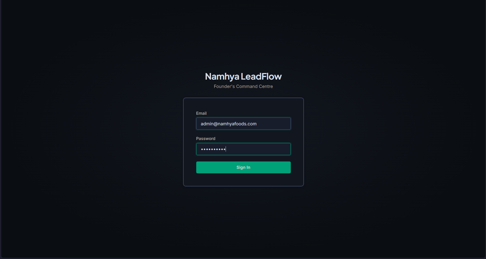
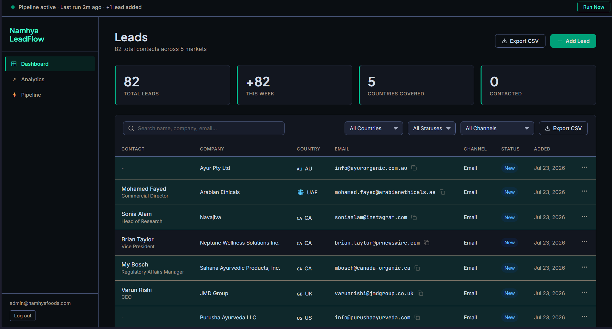
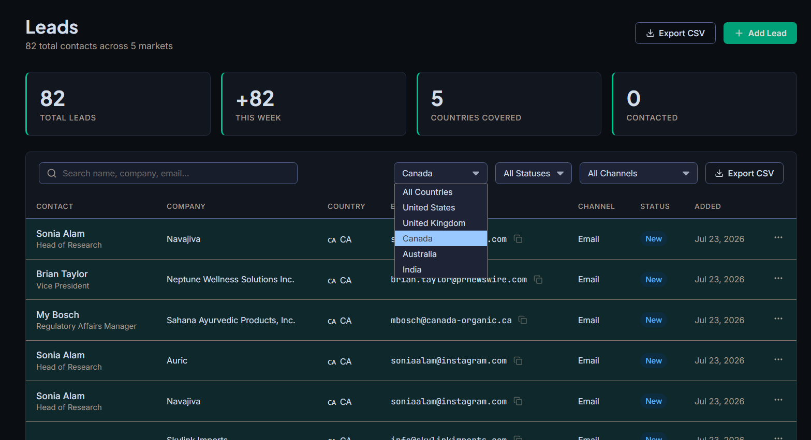
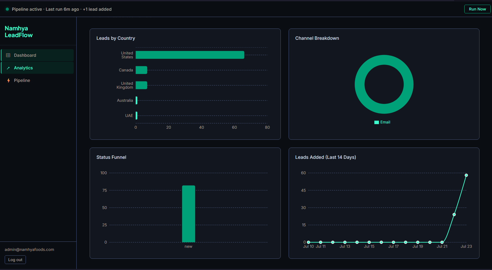
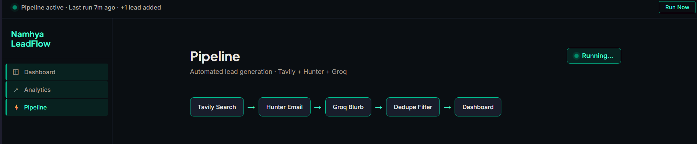

# Namhya LeadFlow — Screenshots

A visual walkthrough of every screen in the app.

---

## Login

---

## Dashboard — Leads Table

---

## Dashboard — Filter Open

---

## Lead Detail Drawer

---

## Analytics

---

## Pipeline Page

---

## Pipeline Pulse Bar — While Running

---

## Make.com Scenario Canvas

